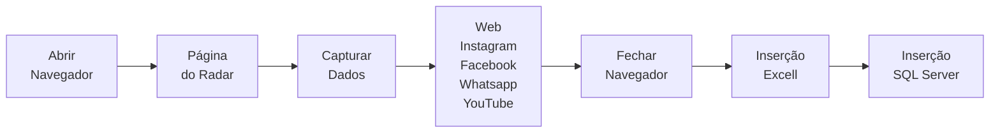
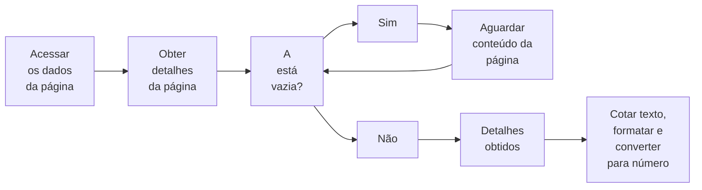

## Comandos SQL Server
### Visualização dos dados
<p> O limite de dados no Excell se limita a 1 milhão de linhas (contando com o cabeçalho), então... Seria impossível abrir CSV por CSV no excell dos dados do SiSU e no mínimo excluir algumas colunas desnecessárias às análises executadas. Existe uma maneira de visualizar e trabahar arquivos grandes de dados no SQL Server, mas preferi não fazer dessa maneira por ser muito trabalhoso e decidi dividir o arquio com mais de 1 milhão de linhas em vários menores limitando-se à 800.000 mil linhas. </p>

### Inserção em massa dos dados
<p> Como são <b>mais de 5 milhões de dados</b>, é completamente inviável fazer isso na mão um por um, assim como por limitações técnicas e financeiras, é impossível realizar através da versão gratuita do Microsoft Power Automate em uma máquina com apenas 8GB de RAM. Então, pelo método raiz, realizei o seguinte comando com algumas observações: </p>

```sql
BULK INSERT tabela FROM 'caminho_do_arquivo' WITH (FORMAT = 'CSV', CODEPAGE = '65001', FIRSTROW = 2, FIELDTERMINATOR = ';', ROWTERMINATOR = '\n');
```
   
- o arquivo deve estar salvo no formato CSV dentro do padrão UTF8 (alfabeto português brasileiro);
- o **CODEPAGE** faz referência à formatação do arquio CSV que está em UTF8;
- o **FIRSTROW** indica onde os valores devem começar a ser cntabilizados ignorando um certo numero delinhas acima que representam o cabeçalho e se iniciam em 1;
- o **FIEDLTERMINATOR** diz respeito a como o **ÚLTIMO CAMPO** que contém informações do arquivo CSV se encerra;
- o **ROWTERMINATOR** diz respeito a como a **ÚLTIMA LINHA** que contém informações do arquivo CSV se encerra e para cada qual existe um código distinto. Para saber como seu arquivo está terminado, basta abrir no WordPad ou no Editor de Texto e ir até o final.

### Média das notas SiSU
<p> No `.csv` em que fora realizado o BULK das informações, as notas estavam no formato numérico com vírgula (','), e para o SQL Server contabilizar como número e permitir a execução de funções e operações numéricas, ele precisa estar no formato com ponto ('.'). Então, primeiro converti todas as colunas de todas as tabelas de varchar para float e depois, executei a média de todas as notas, de todas as colunas, de todas as tabelas. </p>

```sql
-- MÉDIAS DAS NOTAS POR ÁREA
DECLARE @valor_L2020 FLOAT SELECT @valor_L2020 = AVG(CAST(nota_l AS FLOAT)) FROM [tabela]; -- Linguagens
   
-- NÚMERO DE INSCRITOS
DECLARE @inscritos_2020 INT SELECT @inscritos_2020 = COUNT(*) FROM [tabela];
    
-- NÚMERO DE 'M' & 'F'
DECLARE @fies_M2020 INT SELECT @fies_Am2020 = SUM(CASE WHEN sexo LIKE '%M%' THEN 1 ELSE 0 END) FROM [tabela];
    
-- NÚMERO DE BRANCOS, AMARELOS E PPI
DECLARE @fies_Am2020 INT SELECT @fies_Am2020 = SUM(CASE WHEN raca_cor LIKE '%AMARELA%' THEN 1 ELSE 0 END) FROM [tabela];
    
-- RENDA PER CAPITA POR CLASSE
DECLARE @a FLOAT = 0;
DECLARE @b FLOAT = 1254;
DECLARE @c FLOAT = 1255;
DECLARE @d FLOAT = 2004;
DECLARE @e FLOAT = 2005;
DECLARE @f FLOAT = 8640;
DECLARE @g FLOAT = 8641;
DECLARE @h FLOAT = 11261;
DECLARE @i FLOAT = 11262;
    
DECLARE @classe_E INT SELECT @classe_E = COUNT(*) FROM [tabela] WHERE renda_familiar >= @a AND renda_familiar <= @b;
...
DECLARE @classe_A INT SELECT @classe_A = COUNT(*) FROM [tabela] WHERE renda_familiar >= @i;
    
-- MEMBROS FAMÍLIA
DECLARE @j FLOAT = 1;
DECLARE @k FLOAT = 2;
DECLARE @l FLOAT = 3;
DECLARE @m FLOAT = 4;
    
DECLARE @n_1 INT SELECT @n_1 = COUNT(*) FROM [tabela] WHERE n_familia = @j;
...
DECLARE @n_a INT SELECT @n_a = COUNT(*) FROM [tabela] WHERE n_familia >= @m;
```
	
### De varchar para float
<p> Tive que tratar de nulos, mudança de vírgula para ponto e etc.</p>

```sql
-- VÍRGULA PARA PONTO
UPDATE [tabela] SET [coluna] = REPLACE([coluna], ',', '.') WHERE ISNUMERIC([coluna]) = 1;
    
-- TRATA ESPAÇOS EM BRANCO COMO NULOS
UPDATE [tabela] SET [coluna] = NULL WHERE [coluna] = '';
    
-- REMOVE ESPAÇOS EM BRANCO
UPDATE [tabela] SET [coluna] = LTRIM(RTRIM([coluna]));
    
-- CONVERTE PARA FLOAT/INT
UPDATE [tabela] SET [coluna] = CAST([coluna] AS FLOAT);
```

#### Agrupamento por Curso
```sql
-- NORDESTE 'AL', 'BA', 'CE', 'MA', 'PB', 'PE', 'PI', 'RN', 'SE'
DECLARE @r1 VARCHAR(255) = 'NORDESTE'; DECLARE @u1 VARCHAR(2) = 'AL'; DECLARE @u2 VARCHAR(2) = 'BA'; DECLARE @u3 VARCHAR(2) = 'CE'; DECLARE @u4 VARCHAR(2) = 'MA';  DECLARE @u5 VARCHAR(2) = 'PB'; DECLARE @u6 VARCHAR(2) = 'PE'; DECLARE @u7 VARCHAR(2) = 'PI'; DECLARE @u8 VARCHAR(2) = 'RN'; DECLARE @u9 VARCHAR(2) = 'SE';

-- NORTE 'AC', 'AP', 'AM', 'PA', 'RO', 'RR', 'TO'
DECLARE @r2 VARCHAR(255) = 'NORTE'; DECLARE @u10 VARCHAR(2) = 'AC'; DECLARE @u11 VARCHAR(2) = 'AP'; DECLARE @u12 VARCHAR(2) = 'AM'; DECLARE @u13 VARCHAR(2) = 'PA';  DECLARE @u14 VARCHAR(2) = 'RO'; DECLARE @u15 VARCHAR(2) = 'RR'; DECLARE @u16 VARCHAR(2) = 'TO';

-- CENTRO-OESTE 'DF', 'GO', 'MT', 'MS'
DECLARE @r3 VARCHAR(255) = 'CENTRO-OESTE'; DECLARE @u17 VARCHAR(2) = 'DF'; DECLARE @u18 VARCHAR(2) = 'GO'; DECLARE @u19 VARCHAR(2) = 'MT'; DECLARE @u20 VARCHAR(2) = 'MS';

-- SUDESTE 'SP', 'RJ', 'ES', 'MG'
DECLARE @r4 VARCHAR(255) = 'SUDESTE'; DECLARE @u21 VARCHAR(2) = 'SP'; DECLARE @u22 VARCHAR(2) = 'RJ'; DECLARE @u23 VARCHAR(2) = 'ES'; DECLARE @u24 VARCHAR(2) = 'MG';

-- SUL 'PR', 'RS', 'SC'
DECLARE @r5 VARCHAR(255) = 'SUL'; DECLARE @u25 VARCHAR(2) = 'PR'; DECLARE @u26 VARCHAR(2) = 'RS'; DECLARE @u27 VARCHAR(2) = 'SC';

-- VARIÁVEIS
-- Organizei as regiões em 5 variáveis e os estados em 27, o ojetivo era apenas ir trocando os numeros conforme região e estado sem precisar digitar novamente. Sei que exite a opção de construir uma função e etc., mas preferi realizar assim por me fazer mais sentido.
DECLARE @regiao VARCHAR(255) = @r5; DECLARE @uf VARCHAR(2) = @u27; DECLARE @curso VARCHAR(255) = 'FILOSOFIA'; DECLARE @ano INT = 2020;
DECLARE @nota_l FLOAT; DECLARE @nota_h FLOAT; DECLARE @nota_b FLOAT; DECLARE @nota_m FLOAT; DECLARE @nota_r FLOAT;
DECLARE @nota_candidato FLOAT; DECLARE @num_a INT; DECLARE @num_b INT; DECLARE @num_l INT; DECLARE @num_v INT;

-- NOTAS CANDIDATO
SELECT 
    @nota_l = AVG(TRY_CAST(REPLACE(nota_l, ',', '.') AS FLOAT)),
    @nota_h = AVG(TRY_CAST(REPLACE(nota_h, ',', '.') AS FLOAT)),
    @nota_b = AVG(TRY_CAST(REPLACE(nota_b, ',', '.') AS FLOAT)),
    @nota_m = AVG(TRY_CAST(REPLACE(nota_m, ',', '.') AS FLOAT)),
    @nota_r = AVG(TRY_CAST(REPLACE(nota_r, ',', '.') AS FLOAT)),
	@nota_candidato = AVG(TRY_CAST(REPLACE(nota_f, ',', '.') AS FLOAT))
FROM [banco_de_dados] WHERE sexo = 'F' AND uf_candidato = @uf AND status_candidato = 'S';

-- MODALIDADE CANDIDATO
SELECT 
    @num_a = COUNT(CASE WHEN modalidade = 'A' THEN 1 ELSE NULL END),
    @num_b = COUNT(CASE WHEN modalidade = 'B' THEN 1 ELSE NULL END),
    @num_l = COUNT(CASE WHEN modalidade = 'L' THEN 1 ELSE NULL END),
    @num_v = COUNT(CASE WHEN modalidade = 'V' THEN 1 ELSE NULL END)
FROM [banco_de_dados] WHERE sexo = 'F' AND uf_candidato = @uf AND status_candidato = 'S';

```

### Dados Disque 100

#### Agrupamento por Região
```sql
DECLARE @sul INT SELECT @sul = SUM(CASE WHEN D.vitima_uf IN ('PR', 'RS', 'SC') AND CHARINDEX('Crianças e adolescentes', D.grupo_violacao) > 0 THEN 1 ELSE 0 END)
FROM [tabela] AS D;
DECLARE @norte INT SELECT @norte = SUM(CASE WHEN D.vitima_uf IN ('AC', 'AP', 'AM', 'PA', 'RO', 'RR', 'TO') AND CHARINDEX('Crianças e adolescentes', D.grupo_violacao) > 0 THEN 1 ELSE 0 END)
FROM [tabela] AS D;
DECLARE @sudeste INT SELECT @sudeste = SUM(CASE WHEN D.vitima_uf IN ('SP', 'RJ', 'ES', 'MG') AND CHARINDEX('Crianças e adolescentes', D.grupo_violacao) > 0 THEN 1 ELSE 0 END)
FROM [tabela] AS D;
DECLARE @nordeste INT SELECT @nordeste = SUM(CASE WHEN D.vitima_uf IN ('AL', 'BA', 'CE', 'MA', 'PB', 'PE', 'PI', 'RN', 'SE') AND CHARINDEX('Crianças e adolescentes', D.grupo_violacao) > 0 THEN 1 ELSE 0 END)
FROM [tabela] AS D;
DECLARE @centro_oeste INT SELECT @centro_oeste = SUM(CASE WHEN D.vitima_uf IN ('DF', 'GO', 'MT', 'MS') AND CHARINDEX('Crianças e adolescentes', D.grupo_violacao) > 0 THEN 1 ELSE 0 END)
FROM [tabela] AS D;
```

#### Agrupamento por cor
```sql
DECLARE @br INT, @pa INT, @pr INT, @am INT, @in INT;

SELECT 
    @br = SUM(CASE WHEN D.suspeito_pf_cor_raca = 'Branca' THEN 1 ELSE 0 END),
    @pa = SUM(CASE WHEN D.suspeito_pf_cor_raca = 'Parda' THEN 1 ELSE 0 END),
    @pr = SUM(CASE WHEN D.suspeito_pf_cor_raca = 'Preta' THEN 1 ELSE 0 END),
    @am = SUM(CASE WHEN D.suspeito_pf_cor_raca = 'Amarela' THEN 1 ELSE 0 END),
    @in = SUM(CASE WHEN D.suspeito_pf_cor_raca = 'Indígena' THEN 1 ELSE 0 END)
FROM [tabela] AS D
WHERE CHARINDEX('Crianças e adolescentes', grupo_violacao) > 0;

```

------------
## Script de Automação
### Fluxo Geral (Main)



###  Captura de Dados


<p>Ao obter os detalhes da página, copiei todo o texto que continha naquela `div` e o cortei obtendo o 'pedaço' de informação que desejava: a pontuação. Em seguida, substitui a vírgula (',') por ponto ('.') para que sua inserção no banco de dados se desse como `double` e não como `varchar`. Por último o converti em número.</p>

### Inserção Excell

### Inserção SQL Server

